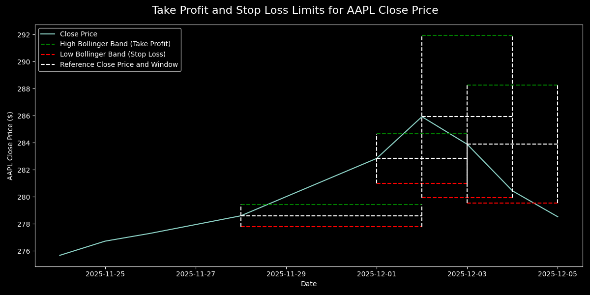

# Project Overview
The purpose of this project is to determine when to take, or exit a position on a financial instrument by training a machine learning model (neural network) on
OHLCV data for market instruments such as the S%P500 pulled from APIs, attempting to deploy the model and generalise on similar data. Labelling of training data is done based on three conditions labelling a datapoint as buy, sell, or hold:

1. For a datapoint, if the future close price exceeds an upper bound within a set time frame it is labelled as buy (1), this is done by specifying a time_frame (say 5 days) and setting the upper bound using a Bollinger band.
2. For a datapoint, if the close price drops below the lower bound withint the set time frame it is labelled as sell (-1), the lower bound is a lower Bollinger band.
3. If the close price does not cross any bounds within the time frame it is labelled as hold (0).

The formulation used to generate the upper and lower Bollinger band is defined as:

$$
\text{Close Price} \pm n\sigma
$$

where:
1. $n$ is a scaling factor (typically 2).
2. $\sigma$ is the standard deviation of closing prices.

# Future Work
Future work should involve:
1. 
